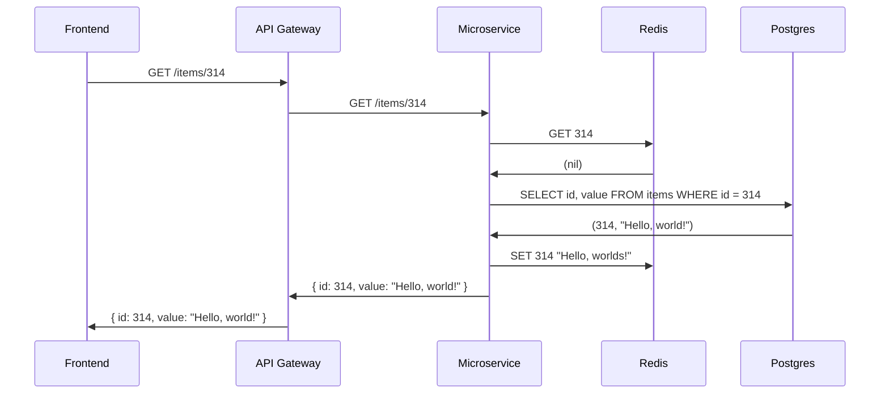

# Шортбол

Шортбол — игра для конференций. Позволяет немного размяться, а также прокачать знание деталей в какой-то технической области.
Для игры нужен мяч, который можно безопасно перебрасывать друг другу.
Такой, который ничего не разобьёт и никому ничего не сломает.

Участникам можно выдавать бейджи с ролями, но это не обязательно, потому что участников немного и они быстро друг друга запоминают.

  

Название *шортбол* выбрано потому, что игра обычно короткая, минут на десять.

Для игры нужна тема, например, *Как работает интернет*.
Раздаём участникам роли, например, *Браузер*, *DNS-сервер*, *Файлвол*, *Реверс-прокси*, *HTTP-сервер*.
Состав можно варьировать в зависимости от количества участников.
Ведущий может отвечать за второстепенные роли, которые возникают не всех сценариях.
Каждый раунд начинаеся с игрока-инициатора, в нашем случае это *Браузер*.
Игрок называет своё имя и роль, говорит, что он собирается сделать и кидает мяч игроку, который должен быть следующим в цепочке.
В нашем случае это должен быть *DNS-сервер*.
Если *Браузер* бросил мяч неправильно, разбираем, почему это неправильно.
В идеале, знаниями должны делиться сами участники, но Ведущий может помогать.

Также Ведущий может подсказывать игроками разные варианты развития событий.
Например, ход получает игрок *Кэш*.
Возможные варианты: а) в кэше есть нужное значение; б) в кэше нет нужного значения.
Во втором случае реализуется развёрнутый вариант сценария — получить значение из базы и сохранить его в кэше.
Благодаря вариантам, можно проводить несколько раундов игры с одними и теми же участниками.

Ниже представлены сценарии для игры в виде даиграмм последовательностей.

## Микросервисная архитектура

Варианты сценария:
* Просрочен `access_token`, не просрочен `refresh_token`.
* Просрочены и `access_token` и `refresh_token`.
* Запись не найдена в Postgres.

